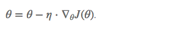
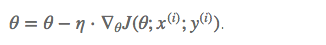
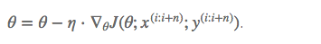

> 主要内容:优化器、局部最优的解决方案、初始化方式

### 一、优化器

**1. 三种常见的优化器**

> 三种优化器的参数量是一样的，x~i~有多少个特征，输入就有多少个节点，只不过SGD是一次迭代后更新，而BGD是N次迭代的累加和后除以N再更新。
>
> > **那么问题来了，机器翻译中，所谓的输入一句话，是怎么实现的，Embedding Average?**
>
> x~i~只有一个特征的话，梯度只有左右两种方向。
> x~i~有两个特征的话，梯度有360°个方向。
> x~i~有三个特征的话，梯度有球个方向。

a. BGD（Batch Gradient Descent）批梯度下降
采用整个数据集计算 梯度，

缺点：

- 更新慢，不能增加新数据实时更新数据
- 局部最优，鞍点

b. SGD（Stochastic Gradient Descent）随机梯度下降
每次采用一个数据计算梯度，

优缺点：

- 训练快，但不会很快收敛
- 能增加新数据
- 比较震荡，因为并不是每次都向整体最优的方向更新，好处是可能因为震荡而重一个局部最优到另一个局部最优
- 同样存在局部最优和鞍点问题

c. MBGD（Min-Batch Gradient Descent）小批量梯度下降
每次去最小批更新数据，

缺点：

- 避开上述两者缺点，比BGD更新快，比SGD稳定。
- 充分利用gpu并行计算特点

**2. 挑战**

- learning rate 固定，小了训练慢，大了不收敛
- 局部最优（驻点）和鞍点

**3. 自适应梯度下降法**

> 所谓自适应，是指自适应学习率
>
> 数据稀疏时用自适应算法好，因为0项多的话，用sgd求得的梯度可能是0

- Adam
- 带动量的SGD

优点：

- 自适应收敛快，sgd收敛缓慢

参考：

https://www.cnblogs.com/guoyaohua/p/8542554.html

http://fyubang.com/2019/08/10/optimizer_sgd/
     

### 二、陷入局部最优的几种解决方案

https://blog.csdn.net/Touch_Dream/article/details/70142482

> 首先知道一点，目前并没有什么方法能够保证找到非凸函数的全局最优解

**1. 设置不同的初始权重**

> 即改变起始位置

**2. 模拟退火**
> 模拟退火的原理是每一步都以一定的概率接受比当前解更差的结果，从而有助有跳出驻点
> 当然，为了保证算法的稳定性，不能每次都跳出来，所以每次迭代后，接受次优解的概率随时间推移慢慢降低。

**3. 通过调大学习率跳出驻点**
https://blog.csdn.net/Touch_Dream/article/details/70142482
a. 当前位置起跳
b. 历史最优起跳

**4. SGD**
因为每一次更新方向并不是全局最优，带有随机性

### 三、权重初始化方法

> 原理：使得输入和输出数据服从相同的分布（高斯或均匀）
> 严格的讲，我们希望参数的均值为0，输入数据和输出数据方差一致
>
> 主要有5中方法
>
> https://blog.csdn.net/mzpmzk/article/details/79839047
>
> https://blog.csdn.net/u012328159/article/details/80025785

- 全零初始化
> 应用在线性回归、logistics回归时还行，但在神经网络重视不可以的
> 这样每一层学到的东西都是一样的（输出一样），没有意义

- 随机初始化

- Xavier 初始化（泽维尔初始化）
> 针对tanh、sigmod

- He 初始化（何凯明初始化）（或叫做MSRA初始化）
> 针对relu

- 预训练初始化（ImageNet，词向量的fune-tuning等）

> 适用于relu

