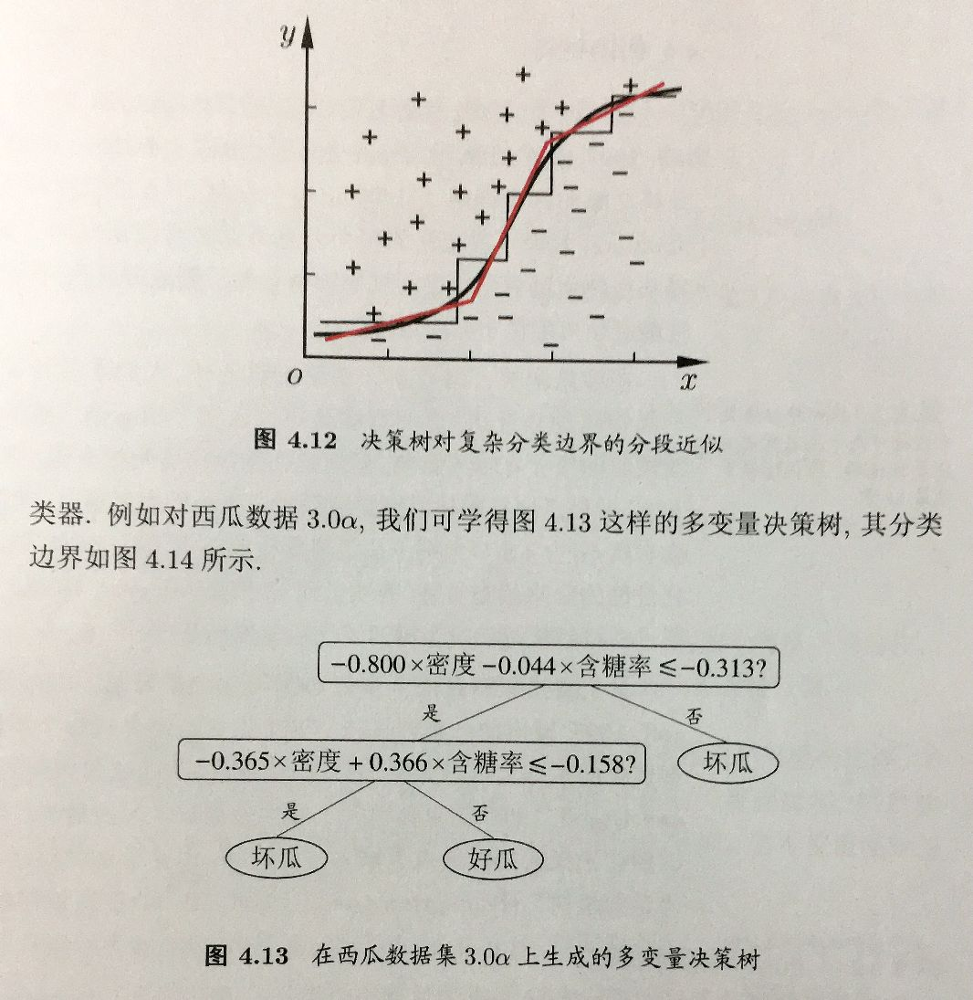

# 决策树

> ID3算法：
> 分治和递归的思想
> 按最优属性划分，如果可以判别为某一类，则判别
> 否则继续按最优属性划分

> **决策时**，
> 每个节点表示一个属性，
> 每条枝干表示节点的值

> **构建树的过程**
> 每个节点表示一个样本集

- 信息熵
> 每个节点都以信息熵
> 熵越小，说明混乱度越低，纯度越高
> 
> 公式与交叉熵一致
> $Ent =  - \sum_c p(c)lnp(c)$
> p(c) 表示样本集中属于c类的概率

- 信息增益
> 按某一特征分类时，父节点（该节点）的信息熵 - 子节点的信息熵的加权和
> $Gain(样本集, 特征) = Ent（样本集）- \sum \frac{|len(样本子集)|}{|len(样本集)|} Ent（样本子集）$
> 
> 越大越好

- 剪枝
  - 预剪枝
  > 构建决策树**时**剪枝
  >
  > 思想：若当前节点的划分不能带来泛化性能的提升，则不对其进行划分
  
  - 后剪枝
  > 构建完决策树**后**剪枝
  > 
  > 思想：自底向上，对每一个非叶子节点，假设将其变为叶子节点后能带来泛化性能的提升，则将其变为叶子节点
  > PS：节点的类别选样本集中最多的那一类

- 多变量决策树
> 每次按最优属性进行划分，相当于决策边界是多条平行于坐标轴的线组成
> 
> 如果我们想要斜的划分（更好的划分），
> 就不能按最优属性划分
> 而应该按属性的加权值划分，此时每个节点就不表示一个属性，而是多个属性的线性组合

参考：周志华《机器学习》
