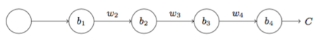
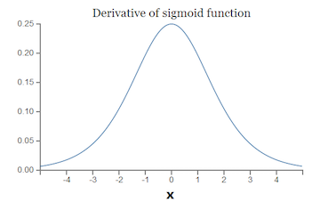

### 三、权重初始化方法

> 原理：使得输入和输出数据服从相同的分布（高斯或均匀）
> 严格的讲，我们希望参数的均值为0，输入数据和输出数据方差一致
>
> 主要有5中方法
>
> https://blog.csdn.net/mzpmzk/article/details/79839047
>
> https://blog.csdn.net/u012328159/article/details/80025785

- 全零初始化
> 应用在线性回归、logistics回归时还行，但在神经网络重视不可以的
> 这样每一层学到的东西都是一样的（输出一样），没有意义

- 随机初始化

- Xavier 初始化（泽维尔初始化）
> 针对tanh、sigmod

- He 初始化（何凯明初始化）（或叫做MSRA初始化）
> 针对relu

- 预训练初始化（ImageNet，词向量的fune-tuning等）

> 适用于relu

至于为什么初始化方式如此重要，主要还是因为两个问题

- 梯度消失
- 梯度爆炸

### 四、梯度消失 梯度爆炸

> 其主要根源就是因为BP反向传播算法，网络太深
> https://zhuanlan.zhihu.com/p/25631496

我们假设这样一个简单的网络：假设每一层只有一个神经元且对于每一层
y~i~=f(z~i~)=f(w~i~x~i~+b~i~)，其中 f 为sigmod函数。

可以推导出：

而sigmod导数如下：

可见其最大为1/4，所以当w也比较小时，|$\sigma'(z)w$|<1，梯度越来越小，直到消失

当w较大时，|$\sigma'(z)w$|<1，梯度越来越大，直到爆炸

> 所以权重初始化很重要

### 五、梯度消失和梯度爆炸的解决方案
https://blog.csdn.net/qq_25737169/article/details/78847691

**1. 针对梯度爆炸的**

- 梯度裁剪
> 原理是设置一个阈值，对梯度做一个限制

- 正则损失
> Loss = (y-Wx)² + a||W||²
> 如果发生梯度爆炸，||W||会很大，因为要最小化 Loss，所以反过来抑制之。

**2. 针对两者的**

- relu 函数
> 大于1部分导数恒为1，那么梯度就只跟W有关，保证W分布稳定的话，每一层的的更新速度相同

- BN
- 残差网络
- LSTM

