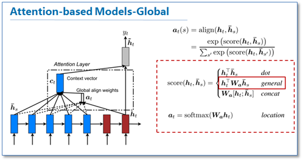
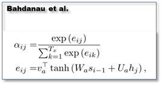

# Attention 的深入理解

[transformer结构理解（包括位置编码）](https://kexue.fm/archives/4765)  
[有趣的transformer(multi head)](http://skyhigh233.com/blog/2017/07/21/transformer/)  
[标准的transformer实现](https://www.jiqizhixin.com/articles/2018-11-06-10)  

> 注意力就是一个加权和

$softmax(qK^{T})V$

> q 是行向量，$K^{T}$每一列表示一个词，V 每一行表示一个词
> 如果是$softmax(QK^{T})V$，那么softmax对应单词对每一行操作

如果是self Attention，即 q 来自 K 中的某个词，则得到 q 的新表达，这个表达等于 K 中所有词的加权和

如果是encoder-decoder Attention，即 q 不是 K 中的词，则得到 q 的下一个预测，这个预测等于 K 中所有词的加权和

最终长度和Q的长度一致

# Attention 优势

对于RNN
- 远距离依赖
- 训练速度（注意，不是测试速度）

对于CNN
- 感受野

# Attention 劣势

- 位置信息

# [attention矩阵](https://www.cnblogs.com/robert-dlut/p/5952032.html)

说简单点呢就是softmax(QK^T^)
详细一点呢就是如图：

