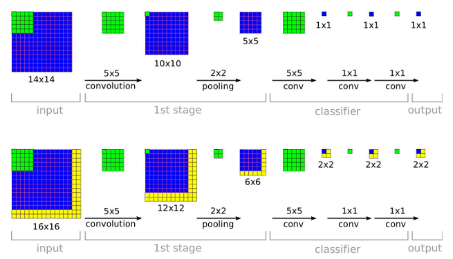

[CNN的训练图像与测试图像不一致的多尺度问题](https://blog.csdn.net/langb2014/article/details/52334109)

对于一个训练好的CNN来说，CNN的结构（如CNN的层数、每一层feature map的个数，卷积层的kernel size
等等）是固定的，但是，每一层的feature map的大小是可以改变的。当测试样本和训练样本大小相同时，CNN
最后一层的每一个节点分别输出一个0~1的实数，代表测试样本属于某一类的概率；当测试样本比训练样本大时，
CNN最后一层每一个节点的输出为一个矩阵，矩阵中的每一个元素表示对应的图像块属于某一类的概率，其结果
相当于通过滑窗从图像中进行采样，然后分别对采样到的图像块进行操作：

