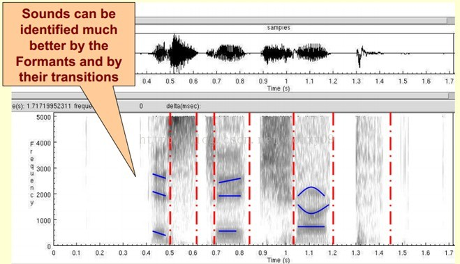
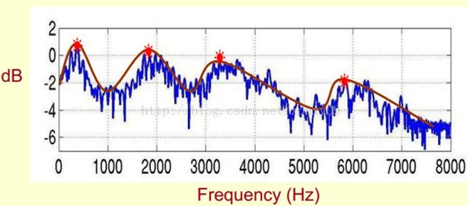
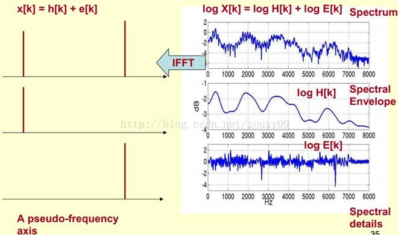

# 语音预知识

> https://blog.csdn.net/zouxy09/article/month/2013/06

声信号的[主观参数（音调、响度、音色），与客观参数（频率、相位、振幅）](https://zhuanlan.zhihu.com/p/35370527)
[音调与频率有关，响度跟振幅有关，音色跟频谱（的谐波有关）](https://zhidao.baidu.com/question/1766492413819074660.html)

[MFCCs](https://blog.csdn.net/zouxy09/article/details/9156785) (Mel Frequency Cepstral Coefficents)：梅尔频率倒谱系数
MFCC特征向量描述了一帧语音信号的功率谱的包络信息

[**Deltas和Delta-Deltas**](http://fancyerii.github.io/books/mfcc/#deltas%E5%92%8Cdelta-deltas%E7%89%B9%E5%BE%81)通常也叫(一阶)差分系数和二阶差分(加速度)系数。MFCC特征向量描述了一帧语音信号的功率谱的包络信息，但是语音识别也需要帧之间的动态变化信息，比如MFCC随时间的轨迹，实际证明把MFCC的轨迹变化加入后会提高识别的效果。严格上来说，他们也属于mfcc特征

频谱有三种：线性振幅谱、对数谱、功率谱

频谱图按时间拼接得到声谱图

声谱图Spectrogram（或者频谱图Spectrum）可以用来观察共振峰，声谱图很黑的地方就是频谱图中的峰值（[共振峰](https://zh.wikipedia.org/wiki/%E5%85%B1%E6%8C%AF%E5%B3%B0)），共振峰单位是Hz。频谱图的峰值就是共振峰。频率最低的共振峰频率称为 f1，第二低的是 f2，以此类推。简单的说，根据f1和f2，就可以大致判断这段音频对应的元音（进而可以确定音素，这是后话）。

声谱图中看共振峰：

声谱图中看共振峰：

[基频f0](https://zh.wikipedia.org/wiki/%E5%9F%BA%E6%9C%AC%E9%A0%BB%E7%8E%87)：自然声音可以分成很多频率不同的正弦波，频率最低的正弦波称为**基音**，其对应的频率称为基音频率。其余的正弦波称为**谐波**，或者称为**泛音**。

基音：又称基波，基音决定**[音高](https://baike.baidu.com/item/%E9%9F%B3%E9%AB%98)**（[其定义](https://zh.wikipedia.org/zh/%E9%9F%B3%E9%AB%98)是人在心理上对基频的感受，那么，音“高”则基频高），进一步决定了[旋律](https://zh.wikipedia.org/wiki/%E6%97%8B%E5%BE%8B)（因为**旋律**是指一系列不同或相同音高的音，以特定的高低关系和节奏关系联系起来的一种音的序列）

泛音：又称谐波，泛音则决定[乐器](https://zh.wikipedia.org/wiki/乐器)或人声的[音色](https://zh.wikipedia.org/wiki/音色)（音色是一种感官属性，没有实际定义，但是他有属于声音主观参数之一，也正是这些泛音决定了发生物体的音色，使人能辨别出不同的乐器甚至不同的人发出的声音。所以我们可以区别出男音和女音，弦乐和管乐）
> 泛音有一个特点，[就是其频率都比基音频率要高](https://zh.wikipedia.org/wiki/%E9%9F%B3%E8%89%B2)（从其定义可知，见wiki音色原理部分），但泛音强度都相对较弱（注意是相对），否则就无法调准乐器的音高了。
>
> 疑惑：泛音强度弱，那是不是意味着f1都出现在基音上

频谱包络(Spectral Envelope)：包络就是一条连接这些共振峰点的平滑曲线。

频谱分解公式：log X[k] = log H[k] + log E[k]（k表示频率），即 频谱 = 频谱包络 + 频谱细节，
频谱包络主要是低频部分（这时候需要转变思维，这时候的横轴就不要看成是频率了，可以看成时间）频谱细节主要包含高频部。如此一来，如何得到h[k]呢？曰：低通滤波器。conv就是用来做这个的。而所谓的**倒谱系数**，就是指h[k]，即包络面的IFFT

Mel 倒谱系数：称为**MFCCs**，指包络面的IFFT，而包络面则来自多个共振峰的平滑，而共振峰可以用来判断元音（进而判断音素）

Mel 频谱 与 线性谱（即线性振幅谱，因为对数谱不是线性谱）关系：
mel(f) = 2595\*log(1+f/700)
也就是说，我们可以通过一组Mel滤波器就得到Mel频谱，公式表示为
X[k'] = X[Mel(k)]，这里，原始线性谱表示为X[k]

Mel 的好处：在Mel频域内，人对音调（即频率）的感知度为线性关系。举例来说，如果两段语音的Mel频率相差两倍，则人耳听起来两者的音调也相差两倍。

关键词：声道的形状