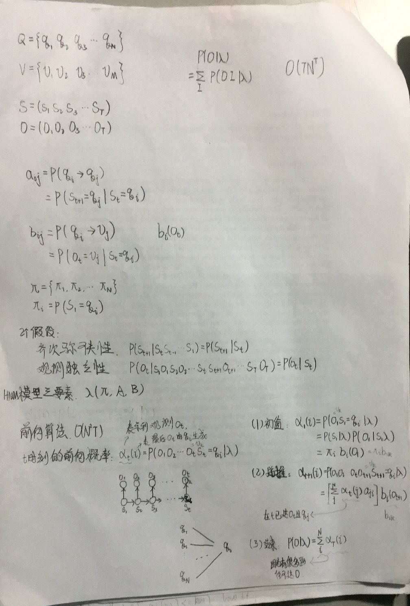

# HMM

**一、名词解释：**

- 状态集：{q~1~，q~2~，q~3~，... ，q~N~}
- 观测集：{v~1~， v~2~，v~3~，... ，v~M~}
- 状态序列 S：(s~1~，s~2~，s~3~，... ，s~T~)
> s~t~ 表示第t时刻的状态，时间戳从 t = 1 开始

- 观测序列 O：(o~1~，o~2~，o~3~，... ，o~T~)
> o~t~ 表示第t时刻的观测，时间戳也从 t = 1 开始

- 状态转移概率矩阵 A~NxN~ ：a~ij~ = P(s~t+1~ = q~j~ | s~t~ = q~i~)
> a~ij~ 表示从状态 q~i~ 到 q~j~ 的转移概率

- 观测概率矩阵 B~NxM~：b~iv~ = P(o~t~ = v~k~ | s~t~ = q~i~)

- 初始状态概率向量 π~Nx1~：π~i~ = P(s~1~ = q~i~)

> A，B，π 称为 HMM 的三要素
> HMM 可以表示为 $\lambda = (A,B,π)$

**二、条件假设**

- 齐次马尔科夫性假设
> P(s~t~ | s~t-1~s~t-2~s~t-3~...s~1~) = P(s~t~ | s~t-1~)
> 当前时刻的状态只与上一时刻的状态有关

- 观测独立性假设
> P(o~t~ | s~1~o~1~s~2~o~2~s~3~o~3~...s~t~s~t+1~o~t+1~...s~T~o~T~) = P(o~t~ | s~t~)
> 所有观测相互独立，当前时刻的观测值取决于当前时刻的状态

**三、P(O|$$\lambda$$)**

**3.1 常规求法**

$P(O|\lambda) = \sum_S P(O,S|\lambda) = \sum_S P(S|\lambda)P(O|S,\lambda)$
> 第一步为全概率公式，S可以视为隐变量
> 第二步为乘法定理

那么我们可以通过求所有O和S的联合概率分布值和来求得此概率值，时间复杂度为O(TN^T^)
> T为观测序列长度，N为状态空间维度
> 穷举所有状态序列为N^T^
> 对每一个状态求观测为TN^T^

**3.2 前向算法**

前向概率 $\alpha_{t}(i)$ = P(o~1~,o~2~,o~3~,...,o~t~ = v~k~, s~t~ = q~i~ | $\lambda$)

> 观测序列已确定，只不过最后一个o~t~可有多中状态状态而来，而i恰表示从第i中状态q~i~转化而来

初值 $\alpha_{1}(i)$ = P(o~1~ = v~k~, s~1~ = q~i~ | $$\lambda$$) = P(s~1~ | $\lambda$) P(o~i~ | s~1~, $$\lambda$$) = π~i~b~ik~
迭代 $\alpha_{t+1}(i) 
\\ = P(o_{1}o_{2},o_{3},...o_{t},o_{t+1}=v_{k},s_{t+1}=q_{i})
\\ = [\sum_{j} \alpha_{t}(j)a_{ji}] b_{ik}$

> 前面所有可能得路径的概率和

终止 $P(O|\lambda) = \sum_{i=1}^{N} \alpha_{T}(i)$

> 前向算法时间复杂度为O(N^2^T)
> 每一个观测有N^2^，共T个观测

参考：李航《统计学习方法》
